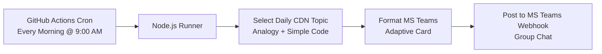

# Implementation Plan - MS Teams Daily CDN Agent

Build an automated Microsoft Teams agent that posts a daily morning educational update in your Teams group chat explaining Content Delivery Network (CDN) concepts using real-world analogies, simple language, and practical code snippets.

## Architecture & Workflow

## Proposed Changes

### Project Structure

#### [NEW] [package.json](file:///Users/venkatesh/.gemini/antigravity/playground/frozen-copernicus/package.json)
- Define Node.js dependencies (`dotenv` for local testing, native `fetch` support for Node 18+).

#### [NEW] [src/cdnLessons.js](file:///Users/venkatesh/.gemini/antigravity/playground/frozen-copernicus/src/cdnLessons.js)
- Pre-curated repository of 30+ structured CDN mini-lessons.
- Each lesson includes:
  - **Topic Name**: (e.g., Cache-Control Header, Anycast Routing, Edge Servers vs Origin).
  - **Simple Analogy**: Real-world comparison (e.g., Pizza distribution centers).
  - **Core Explanation**: 2-3 simple sentences.
  - **Code Example**: Clean, short HTML/JS/HTTP header snippet.
  - **Key Takeaway**: One liner summary.

#### [NEW] [src/teamsWebhook.js](file:///Users/venkatesh/.gemini/antigravity/playground/frozen-copernicus/src/teamsWebhook.js)
- Builds high-quality Microsoft Teams **Adaptive Cards** with rich formatting, markdown syntax highlighting for code blocks, badges, and visual layout.
- Sends payload to `TEAMS_WEBHOOK_URL`.

#### [NEW] [src/index.js](file:///Users/venkatesh/.gemini/antigravity/playground/frozen-copernicus/src/index.js)
- Determines today's lesson (based on day of year modulo total lessons, ensuring consistent sequential daily posts).
- Triggers card creation and webhook delivery.

#### [NEW] [.github/workflows/daily_cdn_bot.yml](file:///Users/venkatesh/.gemini/antigravity/playground/frozen-copernicus/.github/workflows/daily_cdn_bot.yml)
- GitHub Actions workflow running on schedule (e.g. `cron: '0 3 * * *'` -> 8:30/9:00 AM IST / customizable).
- Also supports manual execution (`workflow_dispatch`) for instant testing.

#### [NEW] [README.md](file:///Users/venkatesh/.gemini/antigravity/playground/frozen-copernicus/README.md)
- Step-by-step instructions on:
  1. How to create an Incoming Webhook in your MS Teams Group Chat (using Teams Workflows or Incoming Webhook app).
  2. How to save the webhook URL in GitHub Secrets (`TEAMS_WEBHOOK_URL`).
  3. How to adjust the schedule or add custom CDN topics.

## User Review Required

> [!IMPORTANT]
> To receive messages in your Teams group chat, you will need to generate an **Incoming Webhook URL** in Microsoft Teams and set it as a Secret named `TEAMS_WEBHOOK_URL` in your GitHub Repository. Clear step-by-step instructions are provided in the [README.md](file:///Users/venkatesh/.gemini/antigravity/playground/frozen-copernicus/README.md).

## Verification Plan

### Automated Tests
- Test execution of `node src/index.js` locally using a dry-run flag or mock webhook to verify payload generation and Adaptive Card schema.

### Manual Verification
- Test sending an actual message to a Teams group chat webhook URL using `workflow_dispatch` or local execution.
